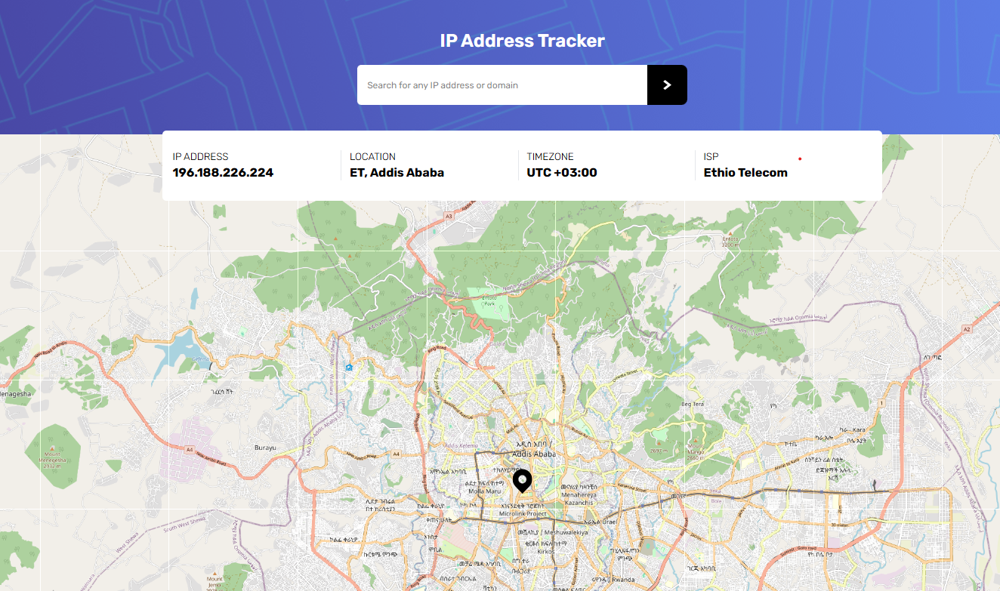

# Frontend Mentor - IP address tracker solution

This is a solution to the [IP Address Tracker challenge on Frontend Mentor](https://www.frontendmentor.io/challenges/ip-address-tracker-I8-0yYAH0). Frontend Mentor challenges help you improve your coding skills by building realistic projects.

## Table of contents

- [Overview](#overview)
  - [The challenge](#the-challenge)
  - [Screenshot](#screenshot)
  - [Links](#links)
- [My process](#my-process)
  - [Built with](#built-with)
  - [What I learned](#what-i-learned)
  - [Continued development](#continued-development)
  - [Useful resources](#useful-resources)
- [Author](#author)

## Overview

### <a name="the-challenge">  💪 The challenge </a>
 
Users should be able to:

- View the optimal layout for each page depending on their device's screen size
- See hover states for all interactive elements on the page
- See their own IP address on the map on the initial page load
- Search for any IP addresses or domains and see the key information and location

### <a name="screenshot"> 📸 Screenshot </a>

### <a name="links"> 🔗 Links </a>

- Solution URL: [React-IP-Address-Tracker](https://github.com/Miki0035/ip_address_tracker)
- Live Site URL: [IP-Tracker](https://ip-address-tracker-rw8d.onrender.com/)

## <a name="my-process"> 🤔 My process </a>

### <a name="built-with"> 🛠️ Built with </a>

- Semantic HTML5 markup
- Flexbox
- Mobile-first workflow
- [Vite](https://vite.dev/) - Build Tool for the Web
- [React](https://reactjs.org/) - JS library
- [Node.js](https://nodejs.org) - Node.js framework
- [TailwindCSS](https://tailwindcss.com/) - TailwindCSS 
- [React Spinner](https://www.davidhu.io/react-spinners/) - React Spinner

### <a name="what-i-learned"> 👨‍🏫 What I learned </a>

This project challenged me in how to retrieve API data from [IP Geolocation](https://geo.ipify.org) and render that data in a beautiful UI for any user using the app. Working with  Asynchronous programming in javascript is a bit challenging in that your app might break if there is something wrong  in retrieving the data and react can't render it. I The challenge also introduced me to the [React Leaflet](https://react-leaflet.js.org/) library that uses the [Leaflet](https://leafletjs.com/) to render a massive and interactive map for better user experience. I also had to use another API ,the [IPwho](https://ipwho.is/), inorder to get the Geographical location (latitude and longitude) of the user based on their IP address. This really expanded my knowledge of API integration and how  async programming works. Thanks 😃 [Frontend Mentor](https://www.frontendmentor.io) for expanding my knowledge with this project.

### <a name="continued-development">🏃‍♂️ Continued development </a>

Areas that I want to focus more on are

- Application Deployment (CI/CD pipleine)
- Error handling 

### <a name="useful-resources"> 📚 Useful resources </a>

- [Alejandro AO - Software & Ai](https://www.youtube.com/watch?v=jD6813wGdBA&t=1991s) - This helped me understand how to use [React Leaflet](https://react-leaflet.js.org/) library
- [ChatGPT](https://chatgpt.com) - This AI helped to implement how to re-route the leaflet map to the new IP Address provided by the user

## <a name="author"> 👨‍🦱 Author </a>

- Website - [Mikiyas Kebede](https://my-portfolio-pvae.onrender.com)
- Frontend Mentor - [@Miki0035](https://www.frontendmentor.io/profile/Miki0035)
- Github - [@Miki0035](https://github.com/Miki0035)
- LinkedIn - [@Mikiyas](https://www.linkedin.com/in/mikiyas-kebede-b661aa225/)
- X - [@MikiMknewkebede](https://x.com/MikiMknewkebede)
